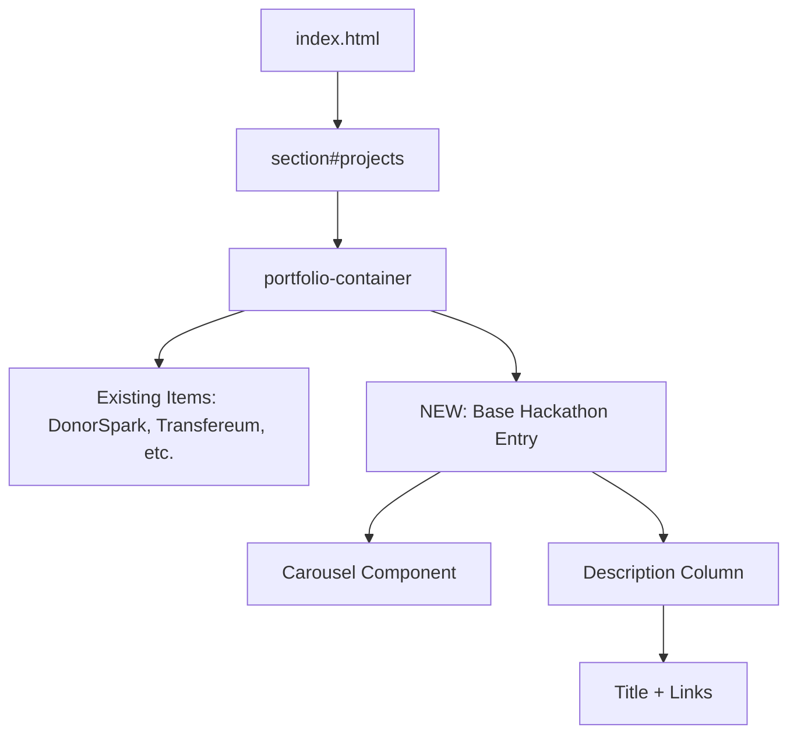

# Design Document

## Overview

This design describes adding a new portfolio entry to `index.html` showcasing the user's role as organizer of the Blockchain@NTU x Base Hackathon. The entry will follow the exact HTML structure and CSS classes used by existing portfolio items (e.g., DonorSpark, Transfereum) to maintain visual consistency.

## Steering Document Alignment

No steering documents exist. This design follows patterns observed directly from the existing codebase.

### Technical Standards
- Bootstrap 4 carousel component for image display
- Bootstrap grid system (col-lg-6, col-lg-10) for responsive layout
- Font Awesome icons for external links (fa fa-github pattern if needed)

### Project Structure
- Portfolio entries located in `index.html` within the `<section id="projects">` container
- Images stored in `assets/img/portfolio/` directory
- Individual project detail pages stored as `{project-name}.html` in root directory

## Code Reuse Analysis

### Existing Components to Leverage
- **Bootstrap Carousel**: Reuse exact carousel structure from existing portfolio items (lines 701-749 pattern)
- **Portfolio Item Container**: Reuse `container row col-lg-10 portfolio-item align-items-center` wrapper
- **Description Column**: Reuse `col-lg-6 d-flex flex-column justify-content-center` for text content
- **Link Styling**: Reuse pipe-separated link format with `target="_blank"` for external links

### Integration Points
- **index.html**: Insert new portfolio item within `row portfolio-container justify-content-center` div
- **Placement**: Add near top of portfolio section (after existing top projects) to highlight leadership role

## Architecture

The implementation is a single HTML block insertion with no JavaScript or backend changes required.



## Components and Interfaces

### Component 1: Hackathon Portfolio Entry (HTML Block)

- **Purpose:** Display hackathon organization experience in portfolio
- **Location:** `index.html` within `portfolio-container` div
- **Structure:**
  ```
  div.container.row.col-lg-10.portfolio-item.align-items-center
  ├── div#baseHackathonIndicators.carousel.slide.col-lg-6
  │   ├── ol.carousel-indicators (with li items for each slide)
  │   ├── div.carousel-inner (with carousel-item divs containing images)
  │   ├── a.carousel-control-prev
  │   └── a.carousel-control-next
  └── div.col-lg-6.d-flex.flex-column.justify-content-center
      ├── h3 (Title)
      ├── p (Bold tagline + description)
      └── p (Links: News Article | Learn More)
  ```
- **Dependencies:** Bootstrap 4 CSS/JS (already loaded)
- **Reuses:** Identical structure to DonorSpark entry (lines 700-762)

### Component 2: Hackathon Detail Page (Optional)

- **Purpose:** Provide detailed information about the hackathon (if user wants Learn More page)
- **Location:** `hackathon.html` in root directory
- **Reuses:** Template from existing detail pages (e.g., `donorspark.html`, `finforge.html`)
- **Note:** Can be deferred; initial implementation can link directly to NTU news article

## Data Models

### Portfolio Entry Content

```
Title: "Blockchain@NTU x Base Hackathon"
Tagline: "Organizer | 200 Builders Worldwide | Singapore"
Description: "Organized a 10-day blockchain hackathon at AWS Singapore in partnership with Base, Virtuals Protocol, Sogni AI, and AWS. Brought together 200 builders from around the world to develop innovative blockchain and AI solutions."
Links:
  - News Article: https://www.ntu.edu.sg/cctf/news-events/news/detail/blockchain-ntu-x-base-hackathon-finals-successfully-conclude--showcasing-student-innovation
  - Learn More: hackathon.html (optional)
```

### Image Assets Required

```
Location: assets/img/portfolio/
Naming Convention: basehackathon1.jpg, basehackathon2.jpg, etc.
Dimensions: 507x234 pixels (matching existing portfolio images)
```

## HTML Template

```html
<div class="container row col-lg-10 portfolio-item align-items-center">
  <div id="baseHackathonIndicators" class="carousel slide col-lg-6" data-ride="carousel">
    <ol class="carousel-indicators">
      <li data-target="#baseHackathonIndicators" data-slide-to="0" class="active"></li>
      <!-- Add more indicators based on number of images -->
    </ol>
    <div class="carousel-inner">
      <div class="carousel-item active">
        
      </div>
      <!-- Add more carousel-items for additional images -->
    </div>
    <a class="carousel-control-prev" href="#baseHackathonIndicators" role="button" data-slide="prev">
      <span class="carousel-control-prev-icon" aria-hidden="true"></span>
      <span class="sr-only">Previous</span>
    </a>
    <a class="carousel-control-next" href="#baseHackathonIndicators" role="button" data-slide="next">
      <span class="carousel-control-next-icon" aria-hidden="true"></span>
      <span class="sr-only">Next</span>
    </a>
  </div>
  <div class="col-lg-6 d-flex flex-column justify-content-center">
    <h3>Blockchain@NTU x Base Hackathon</h3>
    <p>
      <b>Organizer | 200 Builders Worldwide | Singapore</b><br>
      Organized a 10-day blockchain hackathon at AWS Singapore in partnership with Base, Virtuals Protocol, Sogni AI, and AWS. Brought together 200 builders from around the world to develop innovative blockchain and AI solutions.
    </p>
    <p>
      <a href="https://www.ntu.edu.sg/cctf/news-events/news/detail/blockchain-ntu-x-base-hackathon-finals-successfully-conclude--showcasing-student-innovation" target="_blank">News Article</a> |
      <a href="hackathon.html">Learn More</a>
    </p>
  </div>
</div>
```

## Error Handling

### Error Scenarios

1. **Missing Images:**
   - **Handling:** Use placeholder image or single image if hackathon photos not available
   - **User Impact:** Carousel shows single static image instead of rotating slides

2. **Broken External Link:**
   - **Handling:** NTU link is stable institutional URL, unlikely to break
   - **User Impact:** If link breaks, user sees 404 on NTU site

## Testing Strategy

### Manual Testing

1. **Visual Verification:**
   - Verify entry displays correctly alongside existing portfolio items
   - Check responsive behavior on mobile/tablet/desktop viewports
   - Confirm carousel navigation (prev/next buttons, indicators) works

2. **Link Testing:**
   - Verify news article link opens in new tab
   - Verify Learn More link navigates correctly (if implemented)

3. **Cross-Browser Testing:**
   - Test in Chrome, Firefox, Safari
   - Verify Bootstrap carousel compatibility

### Accessibility Testing
- Verify alt text on images
- Verify carousel controls are keyboard accessible
